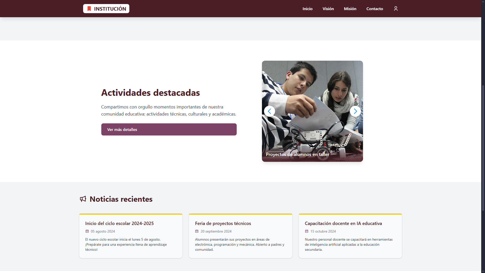
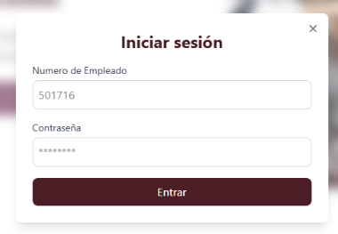
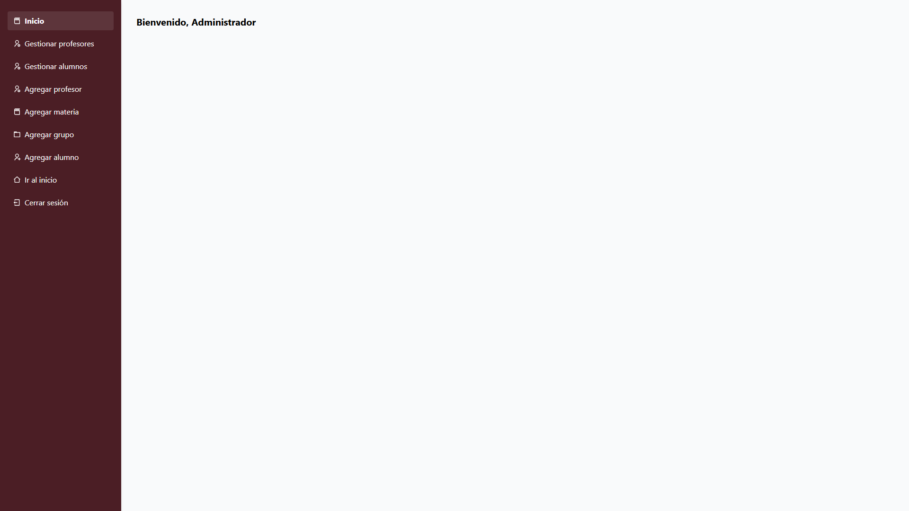

# 🏫 Proyecto Web Institucional – Escuela Secundaria Técnica

Este proyecto representa una **plataforma web moderna y funcional** para una escuela secundaria técnica, desarrollada con **React**, **Tailwind CSS** y **FastAPI**. Diseñada para ser responsiva, intuitiva y escalable, permite gestionar profesores, alumnos, materias, grupos y foros académicos.

---

## 🛠️ Tecnologías utilizadas

### Frontend

* ⚛️ **React**
* 🎨 **Tailwind CSS**
* ✨ **Framer Motion**
* ⚡ **Vite**
* 💡 **React Icons**
* 🧱 **Context API** para manejo de autenticación
* 🌐 **Axios** para consumo de API

### Backend

* 🐍 **FastAPI**
* 🐘 **PostgreSQL** (u otra base real conectada)
* 🛠️ **SQLAlchemy** (ORM)
* 🔐 **JWT**
* 📦 **Uvicorn** para servidor local

---

## 📋 Funcionalidades implementadas

### ✅ Día 1 – Inicio del Proyecto

* Creación del proyecto base con React + Vite + Tailwind
* Setup inicial de rutas, layout general y cambio de tema (dark/light)
* Modal de login animado con Framer Motion
* Configuración de roles (`admin`, `profesor`, `alumno`)
* Interfaz modular con navegación lateral según rol
* Backend funcional con FastAPI, CORS y base de datos SQLite/PostgreSQL

### ✅ Día 2 – Gestión de Profesores y Alumnos

#### 🔐 Seguridad:

* Corrección de inconsistencias en JWT: unificación de `SECRET_KEY` y `decode_access_token`
* Validación efectiva por rol con `allow_roles("admin")`

#### 👨‍🏫 Profesores:

* Alta de profesores con generación automática de usuario y contraseña
* Verificación de duplicados y validación de campos
* Edición de grupos y materia asignada desde modal
* Cambio de contraseña individual desde interfaz

#### 👨‍🎓 Alumnos:

* Listado completo por grupo, grado y turno (Matutino/Vespertino)
* Corrección de lógica de agrupamiento (`normalizar` mejorado)
* Modal de cambio de contraseña individual
* Uso del patrón `"grado°letra - turno"` como identificador de grupo

#### 🧠 Extras:

* Mejora en manejo de errores: lectura de `res.json()` con `res.ok`
* Debug visual con `console.log` para validar estructuras recibidas

### ✅ Día 3 – Foros y mejoras visuales por rol

#### 🌐 Foro Global (Admin, Profesor, Alumno):

* Sección de publicaciones globales con animaciones (Framer Motion)
* Creación, edición y eliminación de publicaciones (profesor y admin)
* Subida de imágenes y archivos adjuntos con vista previa
* Comentarios dinámicos por publicación con despliegue animado
* Reacciones tipo "Me gusta" y menú de opciones por publicación

#### 🌚 Mejoras visuales:

* Encabezado de "📢 Foro Global" fijo y estilizado (responsivo)
* Botón de publicar con diseño responsive, adaptado a móvil
* Paleta institucional: vino (#4b1e25), amarillo (#facc15), blanco y grises
* Línea amarilla decorativa superior en cada publicación y comentario
* Adaptación total a dispositivos móviles (botones, bloques, scroll)

#### 📚 Alumno y Profesor:

* Vista de inicio rediseñada con resumen de actividad y bienvenida
* Alumno: nombre, grupo y rol mostrados con estilo
* Profesor: listado de grupos con número de alumnos por grupo
* Reutilización de layouts para coherencia visual

#### 💬 ChatBot (simulado):

* Mejora de posición para no interferir con botón flotante "Volver arriba"
* Estética con borde vino y textos en tonos suaves

---

## 📌 Pendientes para el futuro.

* [ ] Agregar validaciones visuales en formularios
* [ ] Incorporar reacciones reales tipo "Me gusta"
* [ ] Control granular de permisos para foros por rol
* [ ] Subida pública en **Vercel** y **Railway** con variables .env
* [ ] Evaluación cognitiva y grabación del video de presentación (máx. 2 min)
* [ ] Ajustes finales para presentación con equipo Turing

---

## 🗼 Capturas del proyecto

* Página principal       
 

* Modal de login     
 

* Panel Admin                     
 

---

## 🚀 Instalación local

### Frontend

```bash
git clone https://github.com/tu-usuario/escuela-tecnica-app.git
cd escuela-tecnica-app
npm install
npm run dev
```

Abre [http://localhost:5173](http://localhost:5173) para ver el frontend.

### Backend

```bash
cd backend
pip install -r requirements.txt
uvicorn main:app --reload
```

El backend correrá en [${import.meta.env.VITE_API_URL}](${import.meta.env.VITE_API_URL})

---

## 📁 Estructura del proyecto

```
├── frontend/
│   ├── src/components/
│   ├── src/pages/Admin/
│   ├── src/pages/Profesor/
│   ├── src/pages/Alumno/
│   └── ...
├── backend/
│   ├── models/
│   ├── routers/
│   ├── database.py
│   ├── main.py
│   └── ...
```

---

## ✍️ Autor

**Juan Samael Amaral Bravo**
Frontend y Backend Developer en formación | Ingeniería en Sistemas Computacionales
👨‍💻 [LinkedIn](https://www.linkedin.com/in/samaelamaral/) | 🕺️ Apasionado por la tecnología, educación y videojuegos

---


