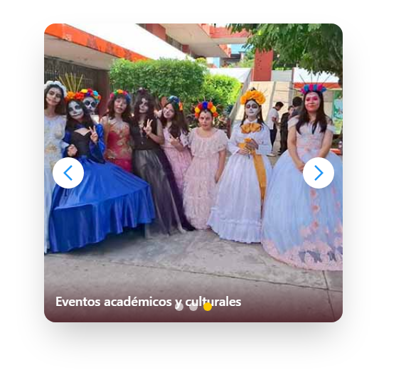

# 🏫 Proyecto Web Institucional – Escuela Secundaria Técnica

Este proyecto representa una **plataforma web moderna** para una escuela secundaria técnica, diseñada con **React** y **Tailwind CSS**, con enfoque institucional, responsivo, accesible y fácil de mantener.

---

## 🛠️ Tecnologías utilizadas

- ⚛️ **React**
- 🎨 **Tailwind CSS**
- ✨ **Framer Motion** (animaciones)
- 📦 **Vite** (como herramienta de desarrollo)
- 💡 **React Icons**
- 🧪 Componentes reutilizables y modularizados

---

## 📋 Funcionalidades implementadas

- ✅ Navegación responsive (menú fijo y hamburguesa en móvil)
- ✅ Cambio de sección dinámico sin recarga (Hero interactivo)
- ✅ Sección de noticias visuales y compactas
- ✅ Slider automático de imágenes institucionales
- ✅ Modal de login con efecto *glassmorphism*
- ✅ Cambio de tema (paleta de colores institucional vs alternativa)
- ✅ Transiciones animadas entre secciones
- ✅ Diseño adaptado a dispositivos móviles

---

## 🖼️ Capturas del proyecto

| Página principal | Modal de login | Slider e imágenes |
|------------------|----------------|-------------------|
|  |  |  |

---

## 🚀 Instalación local

1. **Clona este repositorio**
```bash
git clone https://github.com/tu-usuario/escuela-tecnica-app.git
cd escuela-tecnica-app
```

2. **Instala dependencias**
```bash
npm install
```

3. **Ejecuta el proyecto**
```bash
npm run dev
```

> Abre [http://localhost:5173](http://localhost:5173) para verlo en tu navegador.

---

## 📁 Estructura del proyecto

```
├── public/
│   └── img/         → Imágenes del sitio
├── src/
│   ├── components/  → Header, Hero, Footer, Slider, NewsSection, LoginModal
│   ├── App.jsx      → Componente raíz
│   └── main.jsx     → Punto de entrada
├── tailwind.config.js
├── index.html
└── README.md
```

---

## ✍️ Autor

**Juan Samael Amaral Bravo**  
Frontend Developer en formación | Ingeniería en Sistemas Computacionales  
👨‍💻 [LinkedIn](https://www.linkedin.com/in/samaelamaral/) | 🕹️ Pasión por tecnología, educación y videojuegos

---

## 📌 Pendientes próximos

- [ ] Conectar backend con login real
- [ ] Agregar formulario de contacto funcional
- [ ] Agregar base de datos para noticias dinámicas
- [ ] Subir a Vercel o GitHub Pages
